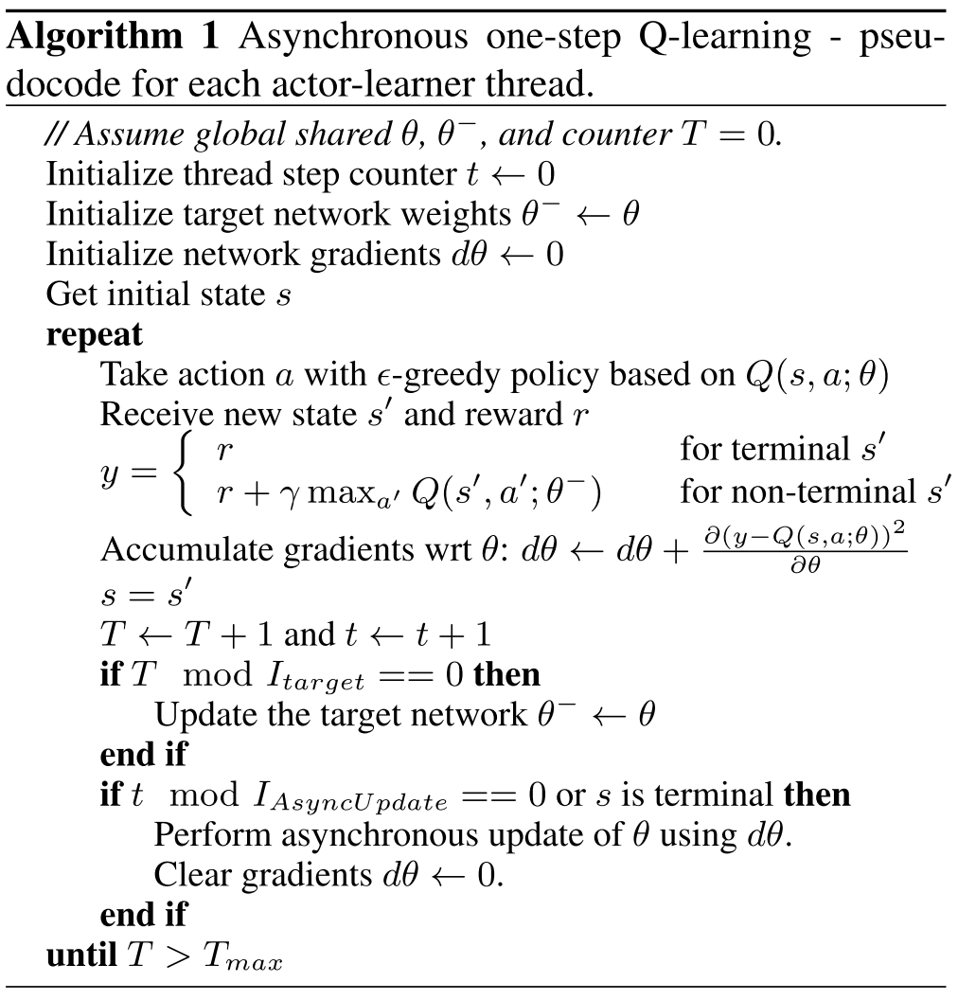
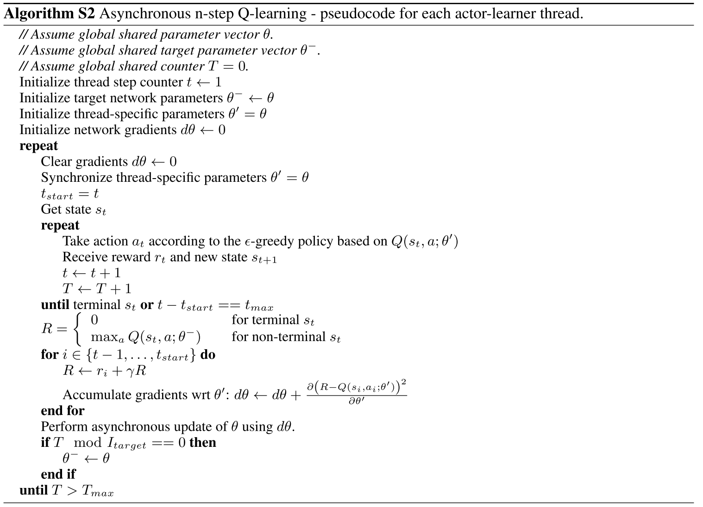
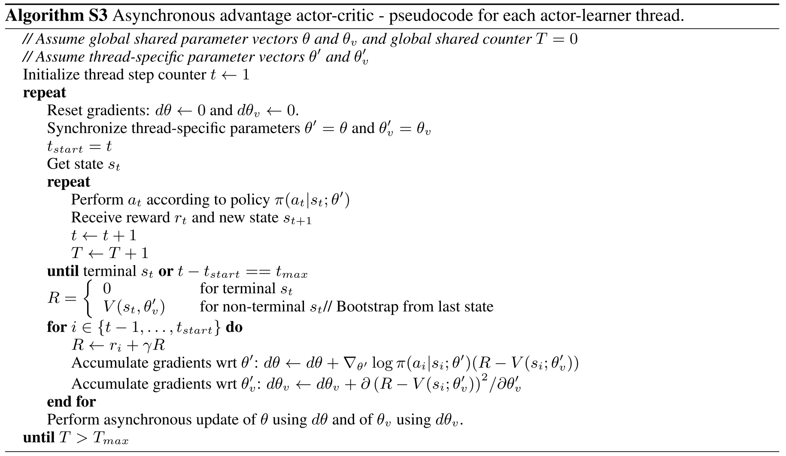

# Asynchronous Methods for Deep Reinforcement Learning

## Reinforcement Learning Background

Environment $E$, time step $t$, state $s_t$, action $a_t$, possible actions $A$, policy $\pi$, scalar reward $r_t$.

Return $R_t = \sum_{k=0}^\infty \gamma^k r_{t+k}, \gamma \in (0, 1]$.

Action value $Q^\pi(s, a) = \mathbb{E}[R_t | s_t = s, a]$ (expected return).

Optimal action value function $Q^*(s, a) = \max_\pi Q^\pi(s, a)$.

State value $V^\pi(s) = \mathbb{E}[R_t | s_t = s] = \sum_{a \in A} \pi(a | s) · Q^\pi(s, a)$.

## value-based method (Q-learning)

$Q(s, a ; \theta) \approx Q^*(s, a)$.

The $i$th loss function:

$$
L_i(\theta_i) = \mathbb{E}(r + \gamma \max_{a'} Q(s', a' ; \theta{i-1}) - Q(s, a ; \theta)) ^ 2
$$

where $s'$ is the state encountered after state $s$.

One-step Q-learning.

## policy-based methods

$\pi(a | s ; \theta)$.

Update the parameters $\theta$ by performing, typically approximate, gradient ascent on $E[R_t]$.

REINFORCE:

* Updates the policy parameters $\theta$ in the direction $\nabla_\theta \log \pi(a_t | s_t ; \theta) R_t$ which is an unbiased estimate of $\nabla_\theta \mathbb{E} [R_t]$.
* Reduce the variance of this estimate while keeping it unbiased by subtracting a learned function of the state $b_t(s_t)$, known as a baseline (Williams, 1992), from the return. Resulting gradient: $\nabla_\theta \log \pi(a_t | s_t ; \theta) (R_t - b_t(s_t))$.

Actor-critic:

* A learned estimate of the value function is commonly used as the baseline $b_t(s_t) \approx V^\pi(s_t)$ leading to a much lower variance estimate of the policy gradient.
* The quantity $R_t − b_t$ used to scale the policy gradient can be seen as an estimate of the *advantage* of action at in state $s_t$, or $A(a_t, s_t) = Q(a_t, s_t)−V(s_t)$.

## Asynchronous RL Framework

First, asynchronous actor-learners, multiple CPU threads on a single machine.

Second, make the observation that multiple actors-learners running in parallel are likely to be exploring different parts of the environment, use different exploration policies in each actor-learner to maximize this diversity.

Benefits:

* Stabilizing learning: By running different exploration policies in different threads, the overall changes being made to the parameters by multiple actor-learners applying online updates in parallel are likely to be less correlated in time than a single agent applying online updates.
* Reduction in training time that is roughly linear in the number of parallel actor-learners.
* Able to use on-policy reinforcement learning methods such as Sarsa and actor-critic to train neural networks in a stable way. 

### Asynchronous onestep Q-learning

### Asynchronous one-step Sarsa

Same as asynchronous one-step Q-learning except that it uses a different target value for $Q(s, a)$ : $r + \gamma Q(s', a' ; \theta^-)$.

### Asynchronous n-step Q-learning

### Asynchronous advantage actor-critic (A3C)

A3C maintains a policy $\pi(a_t|s_t; \theta)$ and an estimate of the value function $V(s_t; \theta_v)$.

Like the variant of n-step Q-learning, the variant of actor-critic also operates in the forward view and uses the same mix of n-step returns to update both the policy and the value-function.

