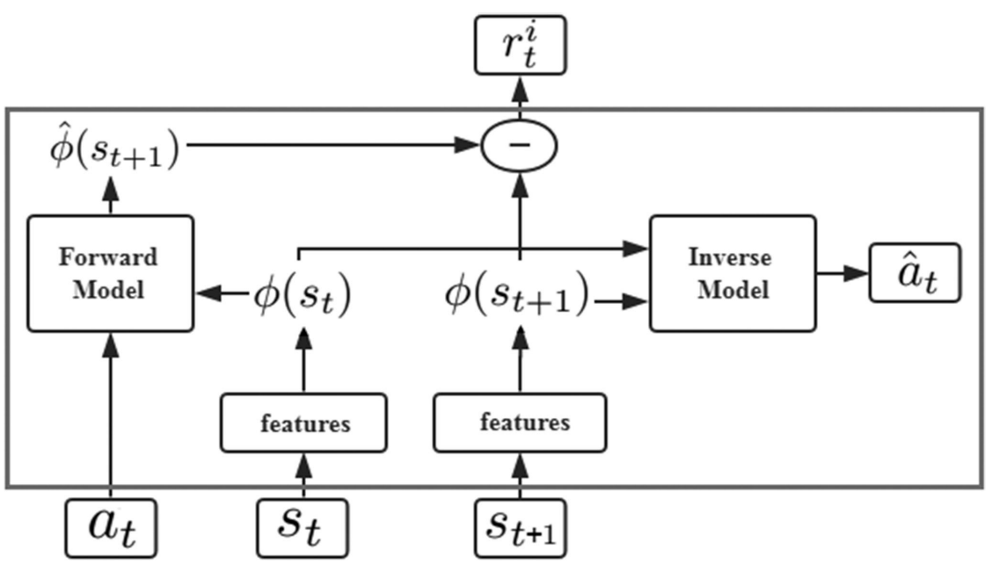
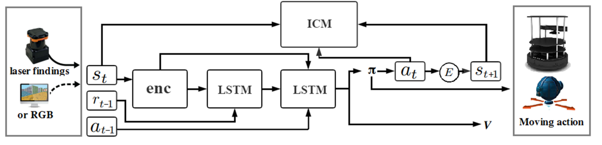

# End-to-End Navigation Strategy With Deep Reinforcement Learning for Mobile Robots

## Problem Statement

Navigation strategies for mobile robots in a map-less environment.

A motion planning model based on DRL. This end-to-end model transfers directly the inputs of the sensor observations and the relative position of the target to the commands of robot’s movement.

Uses *intrinsic curiosity* to allow agents to explore the environment more effectively and as an additional reward in an environment where the rewards are sparse. *Sparse laser ranging results* are also used as the highly abstracted inputs, so agent strategies that are learned by the simulation are effective in the real world.

## Curiosity-Driven Exploration

The original states \\((s_t,s_{t+1})\\) are encoded into the corresponding features \\((\phi(s_t), \phi(s_{t+1}))\\).

The inverse model is trained to predict at using state features \\((\phi(s_t),\phi(s_{t+1}))\\). 

\\(a_t\\) and \\(\phi(s_t)\\) are passed to the forward model, which is used to predict the feature representation \\(\phi(s_{t+1})\\) for the state \\((s_{t+1})\\) and compare it with the real feature \\((\phi(s_t))\\).

For the inverse model, the goal is to learn the function \\(g\\) as follows:

$$
\hat{a}_t = g(s_t, s_{t+1} ; \theta_I)
$$

where \\(\hat{a}_t\\) is the predicted value of the agent’s action \\((a_t)\\) and \\(\theta_I\\) is the neural network parameter that is trained to be optimized as follows:

$$
\min_{\theta_I} L_I(\hat{a}_t, a_t)
$$

Since the action space is discrete, the output of \\(g\\) is a soft-max distribution across all possible actions. 

The loss function \\(L_I\\) is set in the form of cross entropy as follows:

$$
L_I(\hat{a}_t, a_t) = \sum_{i=1}^n -P(a_{t_i}) \ln q(\hat{a}_{t_i})
$$

where \\(n\\) is the size of the action space, \\(P(a_{t_i})\\) is whether the agent chooses the \\(i\\)th action in the actual situation, and \\(q(\hat{a}_{t_i})\\) is the probability of the agent choosing the \\(i\\)th action in the prediction result.

Another neural network is trained for the forward model:

$$
\hat{\phi}(s_{t+1}) = f(\phi(s_t), a_t, \theta_F)
$$

The training process is performed by minimizing the loss function LF as follows:

$$
L_F(\phi(s_t), \hat{\phi}(s_{t+1})) = \frac{1}{2} \parallel \hat{\phi}(s_{t+1}) - \phi(s_{t+1}) \parallel _2^2
$$

The intrinsic reward signal \\(r_t^i\\) measured by the prediction error of the feature encoding is calculated as:

$$
r_t^i = \frac{\eta}{2} \parallel \hat{\phi}(s_{t+1}) - \phi(s_{t+1}) \parallel _2^2
$$

where \\(\eta > 0\\) is the scale factor used to adjust the intrinsic reward.

## Navigation Strategy Based on DRL

The first layer of LSTM accepts the previous rewards and observations. The aim is to establish an association between the original observations and rewards and transmit this to the next level of LSTM. The previous action is passed directly to the LSTM of the second layer.

Finally, connected to two separate output layers including softmax layer and linear layer, respectively, generating policy \\(\pi\\) and value function \\(V\\).

The reward function is divided into two components: the agent interacting with the environment obtains the extrinsic reward \\(r_t^e\\) and the intrinsic reward \\(r_t^i\\).

The policy \\(\pi(s_t ; \theta_p)\\) is represented by a deep neural network with the parameter \\(\theta_p\\).

Sum of the intrinsic reward: \\(r_t = r_t^e + r_t^i\\).

The problem that needs to be optimized overall:

$$
\min_{\theta_p, \theta_I, \theta_F} \Big [-\lambda \mathbb{E}_{\pi(s_t ; \theta_p)}\big [ \sum_t r_t \big ] + (1-\beta) L_I + \beta L_F \Big ]
$$

where \\(\lambda > 0\\) is used to adjust the weight of the policy gradient loss for the curiosity reward, and \\(0 \leq \beta \leq 1\\) is used to adjust the weight between the forward model loss and the inverse model loss.
