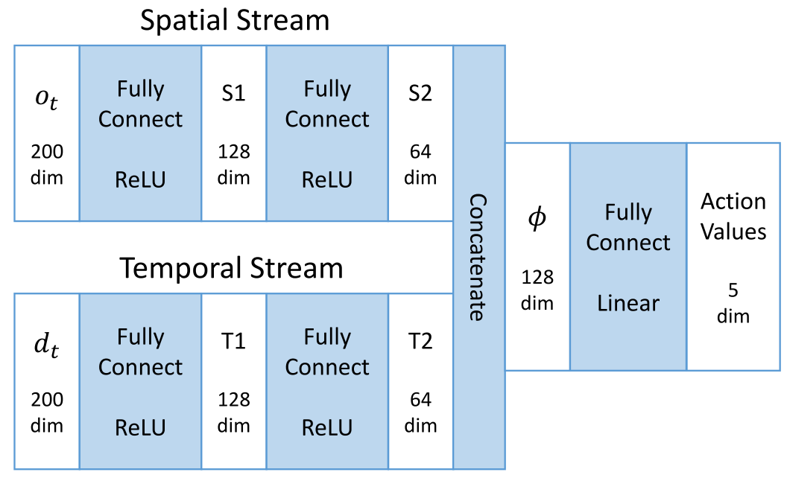
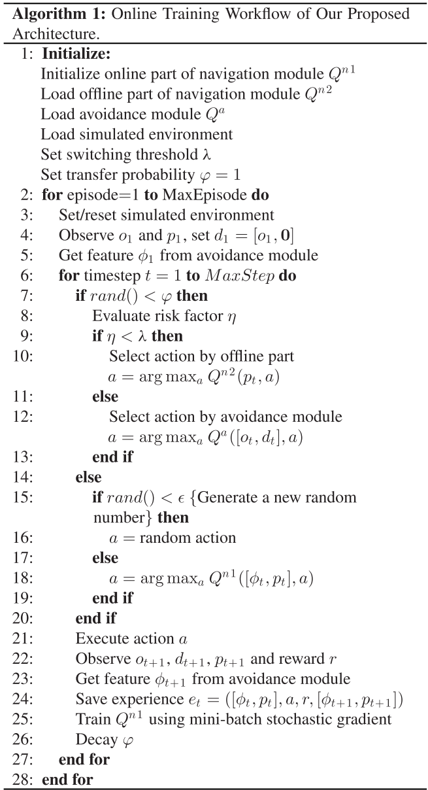

# Learning to Navigate Through Complex Dynamic Environment With Modular Deep Reinforcement Learning

Main contributions:

* A modular architecture for navigation problems is proposed to separately resolve local obstacle avoidance and global navigation, which enables **modularized training** and promotes **generalization ability**.
* A novel two-stream Q-network is developed for obstacle avoidance. By **separating spatial and temporal information** from raw input and processing them individually, this new approach supplements temporal integration of agent observations and surpasses the conventional DQL approach in moving obstacle avoidance tasks.
* We proposed an **action scheduling method**, which combines and exploits the pretrained policies for efficient exploration and online learning in unknown environments.

## RELATED WORK

### Traditional Robotics

The Potential Field Method (PFM).

Vector field histogram (VFH), VFH+, VFH*.

Simultaneous localization and mapping (SLAM), vision-based SLAM.

### Reinforcement Learning

Hierarchical reinforcement learning.

The *option* framework, concurrent option framework, HAM, MAXQ.

DRL: Double Qlearning, Dueling network architecture, deep deterministic policy gradient method, A3C, Hierarchical-DQN.

## PROPOSED APPROACHES

Divide and conquer strategy, divide the main navigation task into two subtasks: **local avoidance** and **global navigation**.

### Avoidance Module

The simulated environment is formalized as a Markov Decision Process (MDP) described by a 4-tuple \\(S, A, P, R\\).

Time step \\(t\\), state \\(s_t \in S\\), action \\(a_t \in A \\), policy \\(\pi\\), reward \\(r_t \sim R(s_t, a_t)\\), new state \\(s_{t+1} = P(s_t, a_t)\\), return \\(R_t = \sum_{t'=t}^T \gamma^{t'-t}r_t^', \gamma in [0, 1]\\).

Action-value function or Q-function: \\(Q^\pi(s, a) = \mathbb{E}[R_t | s_t=s, a_t=a]\\).

Optimal Action-value function or optimal Q-function: \\(Q^*(s, a) = \max_\pi \mathbb{E}[R_t | s_t=s, a_t=a]\\).

This optimal action-value function verifies the *Bellman optimality equation*: \\(Q^*(s, a) = \mathbb{E}[r + \gamma \max_{a'} Q^*(s', a') | s, a]\\).

Then, the Q-function can be estimated by utilizing this equation as an iterative update, which is given by

$$
Q(s, a) \leftarrow Q(s, a) + \alpha [r + \gamma \max_{a'} Q(s', a') - Q(s, a)].
$$

For this avoidance task with LRF observations in a dynamic environment, we proposed a **two-stream Q-network** to approximate the action-value function.

The spatial part is the raw laser scan \\(o_t\\); the temporal part is the difference between the present and the previous laser scans, namely, \\(d_t = o_t - o_{t-1}\\).

The two-stream Q-network is present as \\(Q^\theta (s_t, a_t), s_t = (o_t, d_t)\\).

Two main techniques are employed:

* experience replay
  * The agent’s transition experience \\(e = (s_t, a_t, r_t, s_{t+1})\\) of each step is stored in a replay buffer \\(D = (e_1, \dots, e_N)\\).
* double Q-learning
  * A separated network termed **target network** is introduced to estimate the target for gradient descent update of the main network.

The weights of the main network at training iteration i are updated by minimizing the loss function:

$$
L_i(\theta_i) = \mathbb{E}_{e \sim D} [(y_i - Q^{\theta_i}(s_t, a_t))^2], \\
y_i = r + \gamma \hat{Q}^{\theta^-}(s_{t+1}, \argmax_{a'} Q^{\theta_i}(s_{t+1}, a'))
$$

\\(y_i\\) is the updating target from the separated target network \\(\hat{Q}\\) with parameters\\(\theta^-\\).

The update is performed by gradient descent:

$$
\nabla_{\theta_i}L_i(\theta_i) = \mathbb{E}_{e \sim D} [(y_i - Q^{\theta_i}(s_t, a_t)) \nabla_{\theta_i} Q^{\theta_i}(s_t, a_t)], \\
\theta_{i+1} \leftarrow \theta_i - \alpha \nabla_{\theta_i}L_i(\theta_i)
$$

The learned avoidance control policy: \\(\pi^\theta(s) = \argmax_a Q^\theta(s, a)\\).

To ensure continual exploration, the action is selected by an \\(\epsilon\\)-greedy strategy.

### Navigation Module

Two parts:

* the offline part
  * solve the **simple navigation subtask**: seeking the fastest policy to drive the agent directly to the destination only based on the relative coordinates in a blank environment without any moving obstacles.
  * standard Q-learning algorithm: input is the 2-D vector \\(p_t\\), a large positive reward for reaching the destination and a small negative reward for every time step to urge the agent to get the destination in the fastest way.
* the online part
  * two inputs: 1) a 2-D relative coordinates vector of the destination \\(p_t\\); 2) a 128-D feature \\(\phi\\) from the avoidance module, which conveys both spatial and temporal information of the surrounding situation.
  * a positive reward for reaching the destination and a negative reward for collision and also a small time punishment in each step.
  * the training procedure follows the DQL algorithm, experience replay and double Q-learning.
  * an **action scheduler** to pick up the actions from three action alternatives.

### Action Scheduler

The real-time risk factor \\(\eta\\) is defined as

$$
\eta = \frac{1}{\min(o_t - \kappa d_t)}, \kappa \in [0, 1]
$$

switching threshold \\(\lambda\\), the switching strategy:

$$
a = \begin{cases}
    action_{n2} \ \ \eta < \lambda \\
    action_a \ \ \eta \geq \lambda \\
\end{cases}
$$

where action_a and action_n2 are the action alternatives offered by the avoidance module and the offline part of the navigation module, respectively. 

To guarantee a smooth transfer, we introduce a self-decaying transfer probability \\(\varphi\\). In each step, the agent follows the heuristic policy with the probability \\(\varphi\\) for heuristic exploration, with probability \\((1-\varphi)(1-\epsilon)\\) to exploit its online learning policy.

Besides, we still keep a small probability \\(\epsilon\\) for random exploration to further promote the performance. The (\varphi\\) starts from 1 and decays in each step utill 0.

