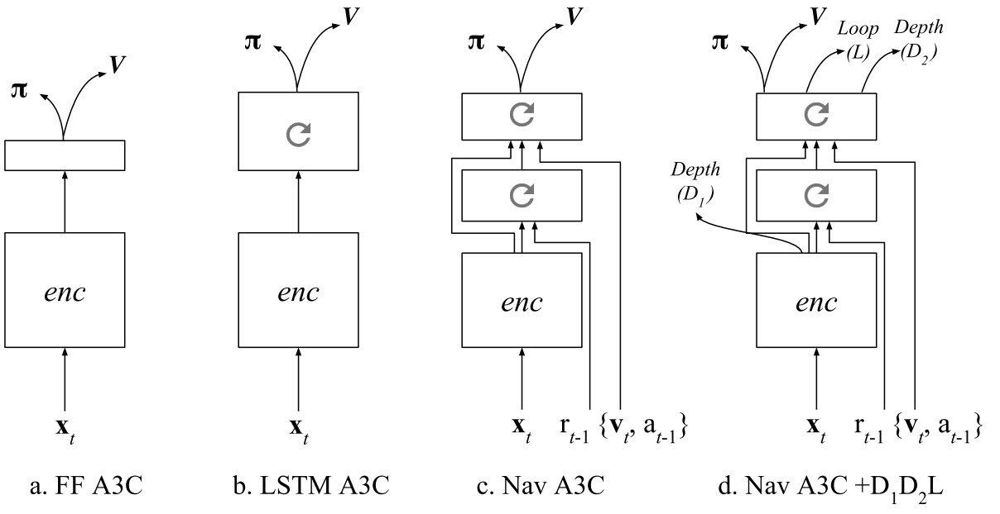

# LEARNING TO NAVIGATE IN COMPLEX ENVIRONMENTS

## APPROACH

An end-to-end learning framework that incorporates multiple objectives:

* maximize cumulative reward using an actor-critic approach.
* minimizes an auxiliary loss of inferring the depth map from the RGB observation.
* detect loop closures as an additional auxiliary task that encourages implicit velocity integration.

The reinforcement learning problem is addressed with the Asynchronous Advantage Actor-Critic (A3C) algorithm.

The baseline: an A3C agent that receives only RGB input from the environment, using either a recurrent or a purely feed-forward model (Figure 1a,b).

To support the navigation capability of our approach, we also rely on the Nav A3C agent (Figure 1c) which employs a two-layer stacked LSTM after the convolutional encoder.

Image \\(\bf{x}_t \in \mathbb{R}^{3 \times W \times H}\\), the agent-relative lateral and rotational velocity \\(\bf{v} \in \mathbb{R}^6\\), the previous action \\(a_{t-1} \in \mathbb{R}^{N_A}\\), and the previous reward \\(r_{t-1} \in \mathbb{R}\\).

Figure 1d shows the augmentation of the Nav A3C with the different possible auxiliary losses.

### DEPTH PREDICTION

While depth could be directly used as an input, we argue that if presented as an additional loss it is actually more valuable to the learning process.

Since the role of the auxiliary loss is just to build up the representation of the model, we do not necessarily care about the specific performance obtained or nature of the prediction. We do care about the **data efficiency** aspect of the problem and also **computational complexity**. We use a low resolution variant of the depth map, reducing the screen resolution to 4x16 pixels.

Two different variants for the loss:

* A regression task. While this formulation, combined with a higher depth resolution, extracts the most information, mean square error imposes a unimodal distribution.
* A classification loss, where depth at each position is discretised into 8 different bands. While it greatly reduces the resolution of depth, it is more flexible from a learning perspective and can result in faster convergence (hence faster bootstrapping).

### LOOP CLOSURE PREDICTION

To produce the training targets, we detect loop closures based on the similarity of local position information during an episode, which is obtained by integrating 2D velocity over time. 
