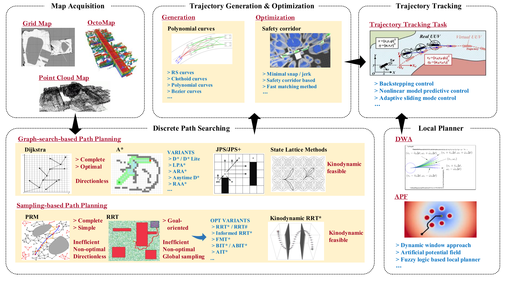

# A Review of Mobile Robot Motion Planning Methods: from Classical Motion Planning Workflows to Reinforcement Learning-based Architectures

主要分为三个部分：

* CLASSICAL MOTION PLANNING OF MRS
* RL-based motion planning approaches
  * MAP-BASED CLASSICAL MOTION PLANNING ALGORITHMS WITH RL OPTIMIZATION
  * RL-BASED MAPLESS MOTION PLANNING METHODS
  * RL-BASED MULTI-ROBOT MOTION PLANNING
* DISCUSSION

## CLASSICAL MOTION PLANNING OF MRS

首先需要获取map representation of the environment，包括occupancy grid map, point cloud map, Voronoi diagram map, Euclidean signed distance fields.

经典运动规划器的经典层次结构如下：

可以分成四个部分：discrete path searching, trajectory generation and optimization, trajectory tracking, and local planner.

### discrete path searching

传统全局DPS算法可以分为两类：the graph-searching-based algorithm (GSBA) and the sampling-based algorithm (SBA).

#### GSBA

主要应用于低维空间上的路径规划问题.

dfs, bfs.

Dijkstra, A*.

Dynamic A* (D*), Lifelong planning A* (LPA*), D* Lite.

Jump point search (JPS), JPS+.

都没考虑运动动力学，State lattice methods被提出来解决这个问题.

#### SBA

更适合高维空间.

Probabilistic road map (PRM), rapid-exploring random tree (RRT).

RRT*, RRT*-smart, RRT#.

fast match trees (FMT*).

kino-dynamic RRT*, informed RRT*, batch informed trees (BIT*).

Real-time RRT* (RT-RRT*), informationdriven RRT* (ID-RRT*).

### trajectory generation and optimization

大多数DPS算法只考虑工作空间的几何约束，在某些情况下，最终的最优或接近最优的分段轨迹对于实际的MR来说是不可执行的.

轨迹生成和优化（TGO）过程考虑了机器人的多重约束（例如，安全约束、运动动力学约束等），并将时间分配机制(time-allocation mechanism)纳入规划过程中，以赋予运动规划器更多的可执行能力。

#### trajectory generation

interpolation-curve-based method: good continuity and differentiability，典型的包括Reeds and Sheep (RS) curves, clothoid curves, polynomial curves, Bezier curves.

#### trajectory optimization

minimum snap algorithm.

EDF-based TGO method.

### trajectory tracking

使 MR 能够跟踪 TGO 流程规划的轨迹.

### local planner

MR需要具备局部重规划能力，以在跟踪全局轨迹的同时应对突发情况.

artificial potential field, reactive replanning method, fuzzy algorithm based method.

其中reactive replanning method 包括 directional approach, dynamic window approach (DWA).

## MAP-BASED CLASSICAL MOTION PLANNING ALGORITHMS WITH RL OPTIMIZATION

在上述传统架构中，规划架构的全局规划器和局部规划器是相互独立的，研究人员需要单独开发它们.此外，为了获得最终的可执行轨迹，研究人员必须解决具有多个约束的优化问题. 这个过程增加了规划方法的复杂性. 此外，经典的运动规划器包含各种子模块，每个子模块都需要繁琐的参数调整过程.

### Global Planners Combined with RL Improvements

approximate value iteration (AVI) RL-based motion planning architecture

PRM-RL algorithm, RL-RRT, AutoRL-based PRM-RL.

### Local Planners Combined with RL Improvements

目的是让机器人在非结构化、动态和不确定的环境中具有更强的操作能力.

hybrid DWA-RL.

AHPF-RL.

Q-learning-based DWA.

soft actor-critic (SAC)-based local planner.

## RL-BASED MAPLESS MOTION PLANNING METHODS

在本节中，我们将审查的重点转移到基于端到端 RL 的运动规划方法，这些运动规划器是无地图的，实现了全局规划器和局部规划器的统一.

可以分为agent-level methods, sensor-level methods两个部分.

### agent-level methods

agent-level methods基于预设的状态估计过程，可以直接获取环境的上层状态信息，更容易训练，这使得机器人能够更快地获得最优规划策略. agent-level methods的观测维度较低，包含更多有用信息，其状态可以等效于原始传感器数据的特征提取之后的输出. 更重要的是，agent-level methods的模拟器的开发难度要小得多. 然而，此类方法依赖于完美感知的假设，或者需要考虑观察编码问题，或者需要额外的通信机制来共享状态信息，这些限制限制了agent-level methods的可扩展性和应用.

### sensor-level methods

sensor-level methods是端到端的，直接建立从原始传感器数据到规划决策的非线性映射.

根据主流研究趋势，以及常用的机器人感知方法，可以分为laser range finder (LRF) based methods 和 visual-based methods.

#### Laser Range Finder based

intrinsic curiosity module

D. Pathak, P. Agrawal, A. A. Efros, and T. Darrell, “Curiosity-driven exploration by self-supervised prediction,” in International Conference on Machine Learning. PMLR, 2017, pp. 2778–2787.

H. Shi, L. Shi, M. Xu, and K.-S. Hwang, “End-to-end navigation strategy with deep reinforcement learning for mobile robots,” IEEE Transactions on Industrial Informatics, vol. 16, no. 4, pp. 2393–2402, 2019.

Y. Wang, H. He, and C. Sun, “Learning to navigate through complex dynamic environment with modular deep reinforcement learning,” IEEE Transactions on Games, vol. 10, no. 4, pp. 400–412, 2018.

EWC-DDPG.

上述大多数运动规划器只能部署在数值模拟空间中，sim-to-real problem.

asynchronous DDPG (ADDPG)-based motion planning algorithm.

assisted-DDPG (AsDDPG).

#### Vision sensors

NavA3C algorithm.

DRL-based targetdriven visual navigation approach.

## RL-BASED MULTI-ROBOT MOTION PLANNING

## DISCUSSION

### Challenges

* Reality Gap
* Sparse reward problem
* Generalization
* Low sample efficiency
* Social etiquette
* Lidar data pre-processing issues
* Catastrophic forgetting problem

### Future Directions

* Task-free RL-based general motion planner
* Meta RL-based motion planning methods
* Multi-modal fusion based RL motion planning methods
* Multi-task objectives based RL motion planning methods
* Human-Machine interaction mode based motion planning methods
* RL-based motion planning of multiple heterogeneous MRs
* Multi-MR flexible formation planning methods
