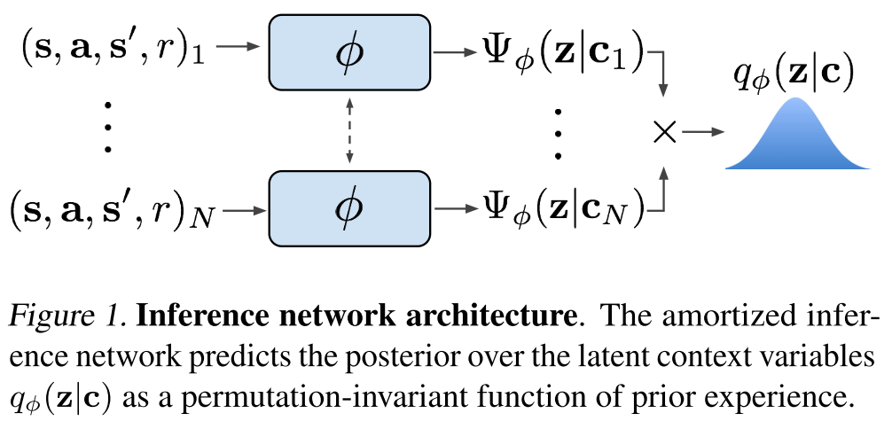
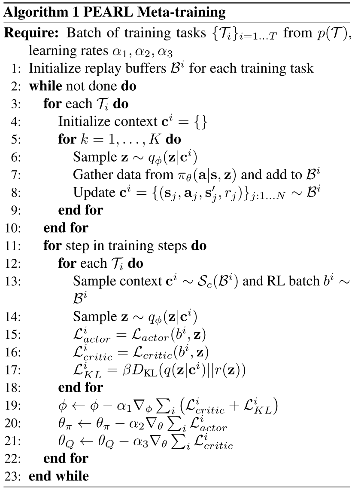

# Efficient Off-Policy Meta-Reinforcement Learning via Probabilistic Context Variables

Most current meta-RL methods require on-policy data during both meta-training and adaptation, which makes them exceedingly inefficient during meta-training.

Meta-learning typically operates on the principle that **meta-training time should match meta-test time** - for example, an image classification meta-learner tested on classifying images from five examples should be meta-trained to take in sets of five examples and produce accurate predictions (Vinyals et al., 2016). This makes it inherently difficult to meta-train a policy to adapt using off-policy data, which is **systematically different from the data the policy would see when it explores (on-policy)** in a new task at meta-test time.

To achieve both meta-training efficiency and rapid adaptation, we propose an approach that integrates **online inference of probabilistic context variables** with existing off-policy RL algorithms.

***Context-based* meta-RL methods**.

Probabilistic meta-learning.

Posterior sampling.

Partially observed MDPs.

## Problem Statement

Assume a distribution of tasks \\(p(T)\\), where each task is a Markov decision process (MDP).

Assume that the transition and reward functions are **unknown**, but can be sampled by taking actions in the environment.

Formally, a task \\(T = {p(s_0), p(s_{t+1} | s_t, a_t), r(s_t, a_t)}\\), initial state distribution \\(p(s_0)\\), transition distribution \\(p(s_{t+1} | s_t, a_t)\\), reward function \\(r(s_t, a_t)\\).

Given a set of training tasks sampled from \\(p(T)\\), the meta-training process learns a policy that adapts to the task at hand by conditioning on the history of past transitions, which we refer to as *context* \\(c\\).

Let \\(c_n^T = (s_n, a_n, r_n, s_n')\\) be one transition in the task \\(T\\) so that \\(c_{1:N}^T\\) comprises the experience collected so far.

At test-time, the policy must adapt to a new task drawn from \\(p(T)\\).

## Probabilistic Latent Context

We capture knowledge about how the current task should be performed in a latent probabilistic context variable \\(Z\\), on which we condition the policy as \\(\pi_\theta(a | s, z)\\) in order to adapt its behavior to the task.

### Modeling and Learning Latent Contexts

amortized variational inference

Train an *inference network* \\(q_\phi(z | c)\\), that estimates the posterior \\(p(z | c)\\).

\\(q_\phi(z | c)\\) can be optimized in a model-free manner to model the state-action value functions or to maximize returns through the policy over the distribution of tasks. Assuming this objective to be a log-likelihood, the resulting variational lower bound is:

$$
\mathbb{E}_T[\mathbb{E}_{z \sim q_\phi(z | c^T)}[R(T, z) + \beta D_{KL}(q_\phi(z | c^T) || p(z))]]
$$

where \\(p(z)\\) is a unit Gaussian prior over \\(Z\\) and \\(R(T, z)\\) could be a variety of objectives, as discussed above.

We note that an encoding of a fully observed MDP should be **permutation invariant**.

Choose a permutation-invariant representation for \\(q_\phi(z | c_{1:N})\\), modeling it as a product of independent factors

$$
q_\phi(z | c_{1:N}) \propto \prod_{n=1}^N \Psi_\phi(z | c_n)
$$

To keep the method tractable, we use Gaussian factors \\(\Psi_\phi(z | c_n) = N(f_\phi^\mu(c_n), f_\phi^\sigma(c_n))\\), which result in a Gaussian posterior.

The function \\(f_\phi\\), represented as a neural network parameterized by \\(\phi\\), predicts the mean \\(\mu\\) as well as the variance \\(\sigma\\) as a function of the \\(c_n\\), is shown in Figure 1.

### Posterior Sampling and Exploration via Latent Contexts

PEARL directly infers a posterior over the latent context Z, which may encode the MDP itself if optimized for reconstruction, optimal behaviors if optimized for the policy, or the value function if optimized for a critic.

## Off-Policy Meta-Reinforcement Learning

Our main insight in designing an off-policy meta-RL method with the probabilistic context in Section 4 is that **the data used to train the encoder need not be the same as the data used to train the policy**.

The policy can treat the context \\(z\\) as part of the state in an off-policy RL loop, while the stochasticity of the exploration process is provided by the uncertainty in the encoder \\(q(z|c)\\). The actor and critic are always trained with off-policy data sampled from the entire replay buffer \\(B\\).

We define a sampler \\(S_c\\) to sample context batches for training the encoder.

Allowing \\(S_c\\) to sample from the entire buffer presents too extreme of a distribution mismatch with on-policy test data. However, the context does not need to be strictly on-policy; we find that an in-between strategy of sampling from a replay buffer of recently collected data retains on-policy performance with better efficiency.

soft actor-critic algorithm (SAC), an off-policy actorcritic method based on the maximum entropy RL objective which augments the traditional sum of discounted returns with the entropy of the policy.

The critic loss can then be written as

$$
L_{critic} = \mathbb{E}_{(s, a, r, s') \sim B, z \sim q_\phi (z | c)} [Q_\theta(s, a, z) - (r + \bar{V}(s', \bar{z}))] ^ 2
$$

where \\(\bar{V}\\) is a target network and \\(\bar{z}\\) indicates that gradients are not being computed through it.

The actor loss is nearly identical to SAC, with the additional dependence on \\(z\\) as a policy input:

$$
L_{actor} = \mathbb{E}_{s \sim B, a \sim \pi_\theta, z \sim q_\phi(z | c)}[D_{KL}(\pi_\theta(a | s, \bar{z}) \parallel \frac{\exp(Q_\theta(s, a, \bar{z}))}{\mathcal{Z}_\theta(s)})]
$$
