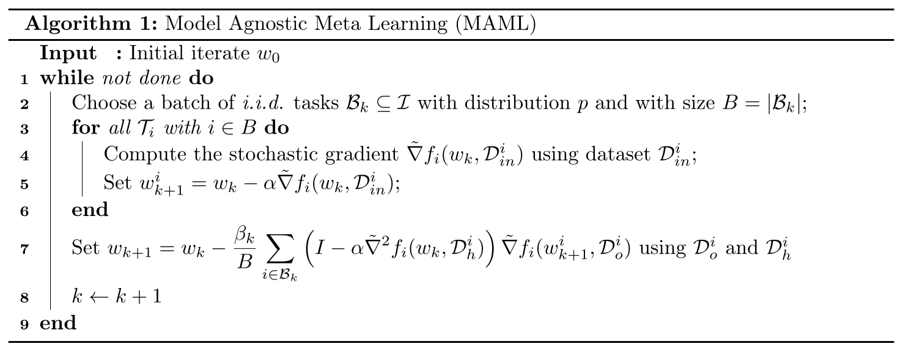
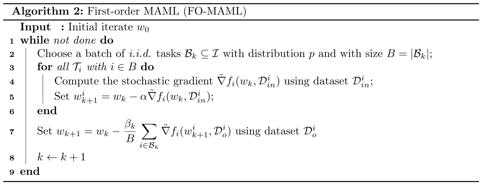
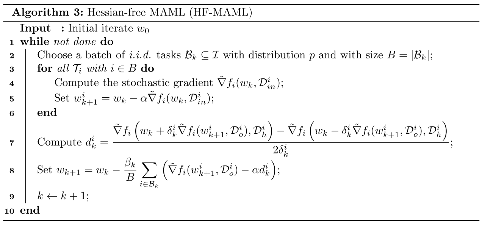

# On the Convergence Theory of Gradient-Based Model-Agnostic Meta-Learning Algorithms

文章研究了MAML和FO-MAML的收敛理论，根据梯度范数分析了它们对于非凸损失函数的计算复杂度和能够达到的准确率级别(level)。

作者提出MAML对于任意的\\(\epsilon\\)，可以在\\(O(1/\epsilon^2)\\)次迭代内找到一个\\(\epsilon\\)-一阶导不动点，每次迭代复杂度为\\(O(d^2)\\)，\\(d\\)为问题维数，而FO-MAML将每次迭代的复杂度降低为了\\(O(d)\\)，但不能保证达到想要的准确率级别。

最后作者提出Hessian-free MAML(HF-MAML)算法，既能保有MAML的所有理论保证，又能降低每次迭代的复杂度为\\(O(d)\\)。

## MAML算法和FO-MAML算法

作者用自己的符号表示了两个算法：

其中MAML算法需要求损失函数的二阶导Hessian矩阵，而FO-MAML将其近似掉了，作者这里设置计算二阶导的数据集\\(D_h^i\\)和计算一阶导的数据集\\(D_o^i\\)相互独立，为了使用更小的\\(D_h^i\\)来减少计算量。

## Hessian-free MAML

对于任意函数\\(\phi\\)，其Hessian矩阵和任意向量\\(v\\)的乘积可以近似为

$$
\nabla^2\phi(w)v \approx \Bigg[\frac{\nabla\phi(w + \delta v) - \nabla\phi(w - \delta v)}{2\delta}\Bigg]
$$

其误差不超过\\(\rho\delta||v||^2\\)，\\(\rho\\)为\\(\phi\\)的Hessian矩阵的利普希茨连续常数。

将其带入之前MAML的更新中得到

$$
d_k^i := \frac{\tilde{\nabla}f_i\Big(w_k+\delta_k^i\tilde{\nabla}f_i(w_k-\alpha \tilde{\nabla}f_i(w_k,D_{in}^i),D_o^i),D_h^i\Big)-f_i\Big(w_k-\delta_k^i\tilde{\nabla}f_i(w_k-\alpha \tilde{\nabla}f_i(w_k,D_{in}^i),D_o^i),D_h^i\Big)}{2\delta_k^i}
$$

$$
w_{k+1} = w_k - \beta_k \frac{1}{B} \sum_{i \in B_k} \Big[\tilde{\nabla}f_i(w_k-\alpha \tilde{\nabla}f_i(w_k, D_in^i), D_o^i) - \alpha d_k^i\Big]
$$

HF-MAML的算法如下：

## 理论分析

设\\(T = \{T_i\}_{i \in I} \\)表示所有任务的集合，\\(p\\)表示\\(T\\)的概率分布，\\(T_i\\)以\\(p_i := p(T_i)\\)的概率被抽样，\\(T_i\\)的损失函数用\\(f_i(w):\mathbb{R}^d \rightarrow \mathbb{R}\\)表示，定义期望

$$
f(w) := \mathbb{E}_{i \sim p} [f_i(w)]
$$

元学习优化问题：

$$
\min_{w \in \mathbb{R}^d} F(w) := \mathbb{E} _ {i \sim p} [F_i(w)] := \mathbb{E} _ {i \sim p} [f_i(w - \alpha \nabla f_i(w))]
$$

假设\\(F\\)为一般的非凸但光滑的函数。

**定义1**：向量\\(w_\epsilon \in \mathbb{R}^d\\)被称为上述优化问题的\\(\epsilon\\)-近似一阶不动点(first order stationary point, FOSP)，如果其满足：

$$
\mathbb{E} [||\nabla F(w_\epsilon)||] \leq \epsilon
$$

定义说明一个点\\(w_\epsilon\\)是一个\\(\epsilon\\)-FOSP，如果它对全局损失函数\\(F\\)的梯度模长(gradient norm)的期望小于\\(\epsilon\\)。

本节的目的是对于MAML、FO-MAML和HF-MAML寻找两个问题的答案：

* 对于任意的\\(\epsilon>0\\)，可以找到一个\\(\epsilon\\)-FOSP吗？
* 若可以，需要多少次迭代才能到达该不动点？

**假设1**：\\(F\\)有下界，即\\(\min_{w \in \mathbb{R}^d} F(w) > -\infty\\)。

**假设2**：对于任意\\(i \in I\\)，\\(f_i\\)二次连续可微且\\(L_i\\)-光滑，即对于任意\\(w,u \in \mathbb{R}^d\\)，有

$$
||\nabla f_i(w) - \nabla f_i (u)|| \leq L_i ||w - u||
$$

在二次连续可微的假设下，再假设一阶导\\(L_i\\)-光滑可以推出：

$$
-L_i I_d \preceq \nabla^2 f_i(w) \preceq L_i I_d, \forall w \in \mathbb{R}^d \\
-\frac{L_i}{2} ||w - u||^2 \leq f_i(w) - f_i(u) - \nabla f_i(u)^\top (w-u) \leq \frac{L_i}{2}||w-u||^2, \forall w, u \in \mathbb{R}^d
$$

为了简单，此后使用\\(L := \max_i L_i\\)，可以被看作所有\\(i \in I\\)的\\(\nabla f_i\\)利普希茨连续常数。

在MAML的参数更新中出现了\\(f_i\\)的二阶导，所以需要对目标函数的Hessian矩阵施加一个正则性条件：

**假设3**：
